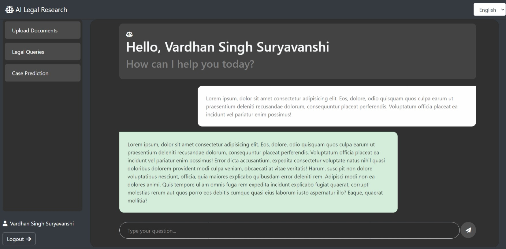
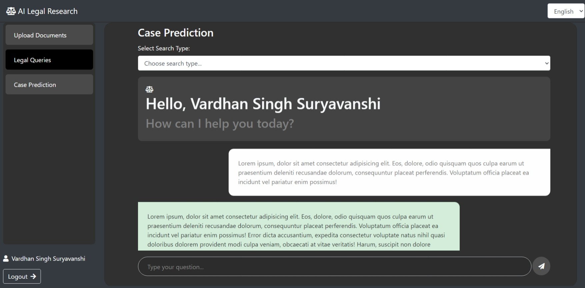
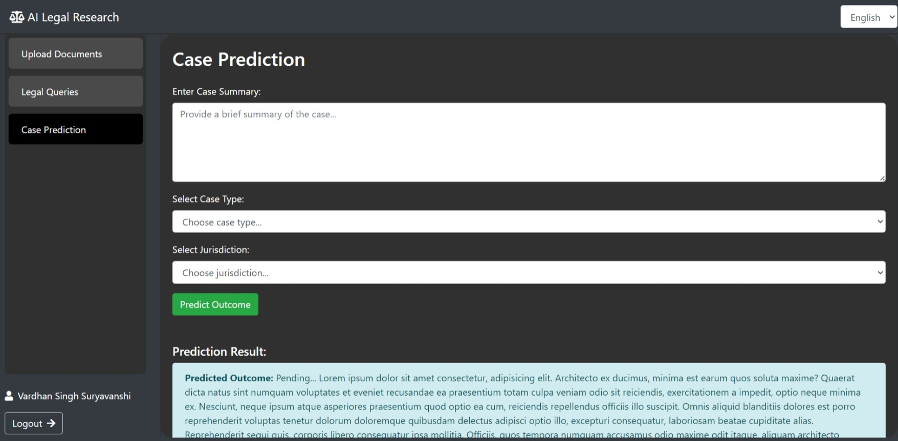

# **Legal Lens: AI-Driven Legal Research Engine**

## **Table of Contents**
- [Project Overview](#project-overview)
- [Features](#features)
- [Tech Stack](#tech-stack)
- [Getting Started](#getting-started)
- [Project Structure](#project-structure)
- [Usage](#usage)
- [Screenshots](#screenshots)
- [Future Enhancements](#future-enhancements)
- [Contributing](#contributing)
- [License](#license)
- [Contact](#contact)

---

## **Project Overview**

**Legal-Lens: AI-Driven Legal Research Engine** is an AI-powered legal research platform tailored for commercial courts. The platform combines the efficiency of AI with intuitive design to simplify legal research, case analysis, and prediction. Lawyers, researchers, and court officials can upload legal documents, seek precise answers to legal questions, and get case predictions within seconds.

## **Features**
- **Legal Document Upload & Analysis**: Upload legal documents (PDF, DOC) and get quick insights and summaries.
- **Case Prediction**: Predict outcomes of commercial court cases based on historical data and AI models.
- **Legal Query Resolution**: Ask legal questions, get accurate responses from AI, and navigate legal terms with ease.
- **Multi-Language Support**: The platform supports multiple languages for a broader reach.
- **Dark Mode**: Default is mode dark theme to suit your environment.
- **User Authentication**: Secure login and logout features for enhanced privacy.
- **Responsive UI**: The interface is optimized for various screen sizes and devices.

## **Tech Stack**
- **Frontend**: HTML, CSS (Bootstrap framework), JavaScript (AJAX, jQuery)
- **Backend**: Django, Python
- **AI/ML Models**: Integrated using TensorFlow/PyTorch (for case prediction and NLP tasks)
- **Database**: SQLite
- **Deployment**: Nginx, Gunicorn

## **Getting Started**

### **Prerequisites**
- Python 3.12+
- Django 5.x
- LLMs

### **Installation**

1. **Clone the repository:**
    ```bash
    git clone https://github.com/SinghIsWriting/Legal-Lens-AI-Driven-Legal-Research-Engine.git
    cd Legal-Lens-AI-Driven-Legal-Research-Engine
    ```

2. **Set up a virtual environment:**
    ```bash
    python3 -m venv venv
    source venv/bin/activate  # On Windows use `venv\Scripts\activate`
    ```

3. **Install the required packages:**
    ```bash
    pip install -r requirements.txt
    ```

4. **Run database migrations:**
    ```bash
    python manage.py migrate
    ```

5. **Start the Django development server:**
    ```bash
    python manage.py runserver
    ```

6. **Access the application:**
    Open your browser and navigate to `http://127.0.0.1:8000`.

### **Environment Variables**

You will need to create a `.env` file in the project root for any private credentials and keys

- - -

## **Usage**

### **1. Upload Legal Documents**
Navigate to the "Upload Document" section, where you can upload your legal documents in PDF or DOC format. The platform will automatically analyze the document and provide a summary.

### **2. Ask Legal Questions**
In the "Legal Queries" section, you can ask specific questions about laws, legal procedures, or terms. The AI-powered bot will respond with relevant information.

### **3. Predict Case Outcomes**
The "Case Prediction" section allows you to predict the outcome of commercial court cases based on past data and case precedents.

### **4. Switch Languages**
Use the language dropdown in the navbar to switch between supported languages.

- - -

## **Screenshots**

### Home Page


### Legal Search Page


### Case Prediction Page


- - -

## **Future Enhancements**
- Advanced search with filters based on case type, jurisdiction, etc.
- Integration with external legal databases.
- User analytics to track the history of searches and documents analyzed.
- Improved AI models for more accurate case predictions.

- - -

## **Contributing**

Contributions are welcome! Please follow these steps:
1. Fork the repository.
2. Create a new branch (`git checkout -b feature-name`).
3. Make your changes and commit them (`git commit -m 'Add feature-name'`).
4. Push to your branch (`git push origin feature-name`).
5. Open a pull request.

- - -

## **License**

This project is licensed under the [MIT License](LICENSE).

- - -

## **Contact**

For any inquiries or support, please reach out to:
- **Name**: Abhishek Singh
- **Email**: sabhisheksingh343204@gmail.com
- **LinkedIn**: [My LinkedIn Profile](www.linkedin.com/in/abhishek-singh-bba2662a9)

- - -
